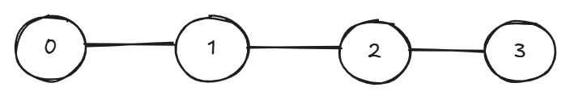
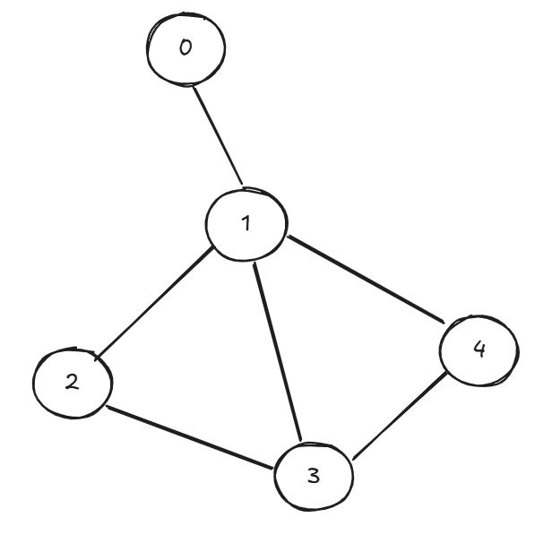
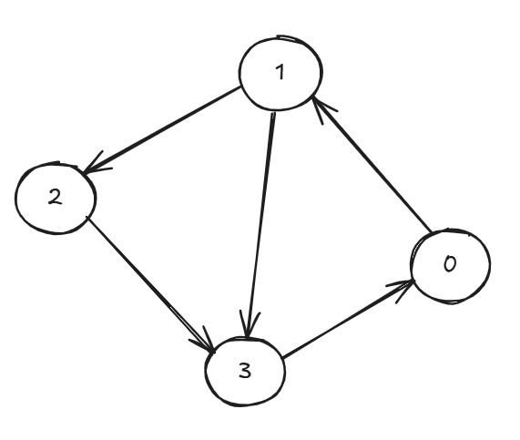
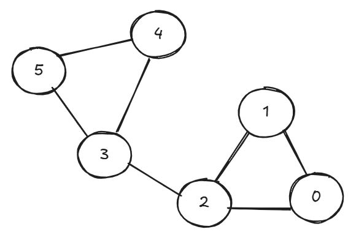

## 📖 What is a Hamiltonian path?
A Hamiltonian path is a sequence of vertices in a graph that visits every vertex exactly once.

If the path returns to the starting vertex, it is called a Hamiltonian cycle.Determining whether a graph has such a path is an NP-complete problem, meaning no known algorithm can efficiently solve all cases.

🔹 Simple example: check out the graph below.



A possible Hamiltonian path is: 0 → 1 → 2 → 3

## ⚙️ Code structure

The code is divided into three main parts:
1- Definition of the Graph class
2- Implementation of the recursive backtracking search
3- Examples of usage

### 🧩 The Graph class
```python
class Graph:
    def __init__(self, num_vertices, directed=False):
        self.V = num_vertices
        self.directed = directed
        self.graph = {i: [] for i in range(self.V)}
```

Attributes:
- V: total number of vertices.
- directed: whether the graph is directed (True) or undirected (False).
- graph: dictionary representing the adjacency list.

Example:
{0: [1, 2], 1: [0], 2: [0]}

```python
def add_edge(self, u, v):
    if 0 <= u < self.V and 0 <= v < self.V:
        self.graph[u].append(v)
        if not self.directed:
            self.graph[v].append(u)
```

Adds an edge between vertices u and v. If the graph is undirected, also adds the reverse edge (v → u).

### 🔍 The Backtracking algorithm

This function recursively explores all possible paths until it finds one that visits all vertices exactly once.

```python
def _solve_hamiltonian_util(self, current_v, path, visited):
    if len(path) == self.V:
        return True

    for neighbor in self.graph[current_v]:
        if neighbor not in visited:
            path.append(neighbor)
            visited.add(neighbor)

            if self._solve_hamiltonian_util(neighbor, path, visited):
                return True

            # Backtrack
            visited.remove(neighbor)
            path.pop()
    return False
```

🧠 Backtracking steps:
- Choose: add an unvisited neighbor to the path.
- Explore: recursively call the function from that neighbor.
- Backtrack: if no valid path is found, remove the last vertex and try another.

```python
def find_hamiltonian_path(self):
    for start_node in range(self.V):
        path = [start_node]
        visited = {start_node}
        if self._solve_hamiltonian_util(start_node, path, visited):
            return path
    return None
```

Tries to find a Hamiltonian Path starting from each possible vertex. Returns the first path found, or None if no solution exists.

### 🧪 Examples of use

#### Example 1 — Undirected Graph (has a path)



```python
g1 = Graph(5, directed=False)
g1.add_edge(0, 1)
g1.add_edge(1, 2)
g1.add_edge(2, 3)
g1.add_edge(3, 4)
g1.add_edge(1, 3)
g1.add_edge(1, 4)

path1 = g1.find_hamiltonian_path()
print(path1)
```

🔸 Expected output: Hamiltonian path found - [0, 1, 2, 3, 4]

#### Example 2 — Directed Graph (has a path)



```python
g2 = Graph(4, directed=True)
g2.add_edge(0, 1)
g2.add_edge(1, 2)
g2.add_edge(2, 3)
g2.add_edge(3, 0)
g2.add_edge(1, 3)

path2 = g2.find_hamiltonian_path()
print(path2)
```


🔸 Expected output: Hamiltonian path found - [0, 1, 2, 3]

#### Example 3 — Undirected Graph (no path)



```python
g3 = Graph(6, directed=False)
g3.add_edge(0, 1)
g3.add_edge(1, 2)
g3.add_edge(2, 0)
g3.add_edge(3, 4)
g3.add_edge(4, 5)
g3.add_edge(5, 3)
g3.add_edge(2, 3)

path3 = g3.find_hamiltonian_path()
print(path3)
```

🔸 Expected output: no Hamiltonian path found.
